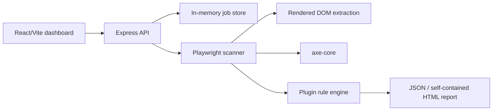

# Architecture

The browser is reused, while every scan receives a fresh isolated browser context. URL validation resolves the hostname and blocks loopback, private, and link-local addresses before browser navigation.
